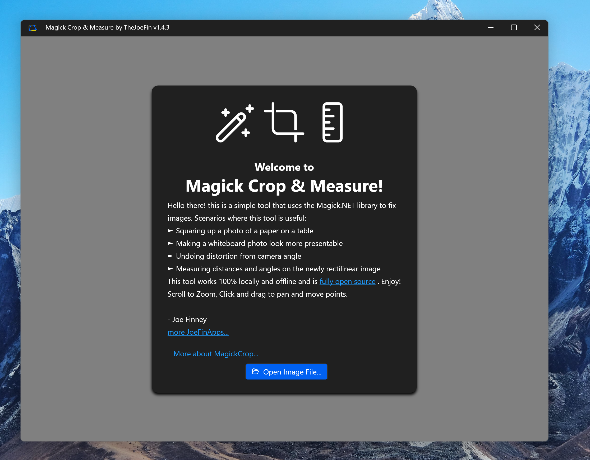
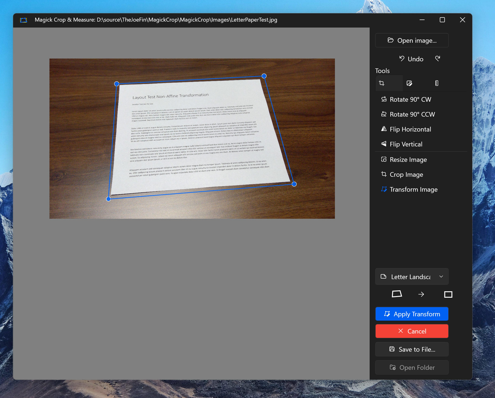

  

<h1 align="center">
  Magick Crop & Measure
</h1>

  Correct perspective distortion in photos with ImageMagick.

  

Using ImageMagick to via to correct perspective distortion in images.

After the perspective distortion has been removed you can use the measure tools!

## Powered by Image Magick, Magick.NET, and OpenCV

- **Magick.NET** - Image processing and transformation
  - GitHub: https://github.com/dlemstra/Magick.NET
  - Nuget: https://www.nuget.org/packages?q=magick.net
- **Emgu.CV** - Computer vision and shape detection
  - Website: http://www.emgu.com/
  - Nuget: https://www.nuget.org/packages/Emgu.CV

This is a simple app which does a few things.

- Open an image
- **Auto-detect rectangular shapes** using OpenCV (new!)
- Align to the 4 corners of the rectangular subject (manually or automatically)
- Set the Aspect Ratio with the drop down
- Save the image which will square the opened image per the selected aspect ratio
- Crop the image
- Resize the image to remove stretch
- Adjust color and contrast
- Measure distance and angle

If you like this app you'll probably enjoy some of my other apps: [JoeFinApps.com](https://www.JoeFinApps.com)

## Architecture

MagickCrop has been migrated to a modern **MVVM (Model-View-ViewModel)** architecture with **Dependency Injection**. This ensures clean separation of concerns, improved testability, and easier maintenance.

**Key Architecture Highlights:**
- **MVVM Pattern**: Clear separation between UI logic (Views), business logic (ViewModels), and data (Models)
- **Dependency Injection**: Services are registered in `App.xaml.cs` and injected into ViewModels
- **Messaging System**: Decoupled communication between components using `WeakReferenceMessenger`
- **Observable Models**: Models use `INotifyPropertyChanged` for automatic UI updates
- **Interface-based Services**: All services have interfaces for loose coupling and testability

**Project Structure:**
- `ViewModels/` - Contains all application logic and state management
- `Services/` - Business logic encapsulation with interface-based design
- `Models/` - Data structures with observable properties
- `Views/` - XAML and minimal code-behind (Views and Controls)
- `Converters/` - Value converters for XAML bindings
- `Messages/` - Message definitions for component communication

For detailed architecture documentation, see [ARCHITECTURE.md](ARCHITECTURE.md).
